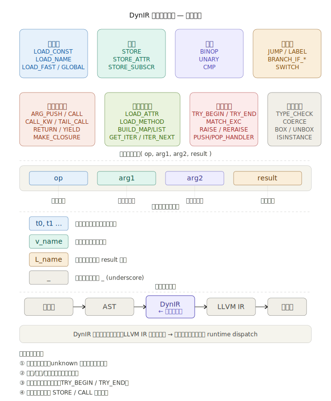

## ccc: 請定義一個四元組中間碼的規格（針對動態語言，類似 Python / JavaScript / Lua），可以作為這些語言翻譯為 LLVM IR 中間的一個過度格式，先給範例，然後再給完整指令集

好的，我先從具體範例帶你感受這個 IR 的風格，再給出完整規格。

---好，現在讓我設計這個 IR 規格。

---

## 第一部分：範例驅動說明

先看幾個具體的程式碼片段，感受這個 IR 的風格。

### 範例 A：基本運算與動態型別

**原始碼（Python 風格）**
```python
x = 1 + "hello"   # 動態語言允許，型別在執行時決定
```

**四元組 IR**
```
(LOAD_CONST,  1,       _,    t0)   ; t0 = 1  (型別: int)
(LOAD_CONST,  "hello", _,    t1)   ; t1 = "hello" (型別: str)
(BINOP,       t0,      t1,   t2)   ; t2 = t0 + t1  (型別: unknown，待 runtime 決定)
(STORE,       t2,      _,    x)    ; x = t2
```

---

### 範例 B：函式呼叫

**原始碼**
```python
result = foo(a, b + 1)
```

**四元組 IR**
```
(LOAD_NAME,   a,    _,       t0)   ; 從環境查找 a
(LOAD_NAME,   b,    _,       t1)   ; 從環境查找 b
(LOAD_CONST,  1,    _,       t2)
(BINOP,       t1,   t2,      t3)   ; t3 = b + 1
(LOAD_NAME,   foo,  _,       t4)   ; 把函式本身 load 進來
(ARG_PUSH,    t0,   0,       _)    ; 推入第 0 個引數
(ARG_PUSH,    t3,   1,       _)    ; 推入第 1 個引數
(CALL,        t4,   2,       t5)   ; 呼叫 t4，共 2 個引數，結果存 t5
(STORE,       t5,   _,       result)
```

---

### 範例 C：條件判斷

**原始碼**
```python
if x > 0:
    y = x
else:
    y = -x
```

**四元組 IR**
```
(LOAD_NAME,   x,    _,       t0)
(LOAD_CONST,  0,    _,       t1)
(CMP,         t0,   t1,      t2)    ; t2 = (t0 > t1) 的比較結果物件
(BRANCH_IF_FALSE, t2, _, L_else)    ; 若 t2 為 falsy，跳到 L_else
(LOAD_NAME,   x,    _,       t3)
(STORE,       t3,   _,       y)
(JUMP,        L_end, _,      _)
(LABEL,       L_else, _,     _)
(LOAD_NAME,   x,    _,       t4)
(UNARY,       NEG,  t4,      t5)    ; t5 = -t4
(STORE,       t5,   _,       y)
(LABEL,       L_end, _,      _)
```

---

### 範例 D：for 迴圈與迭代器協定

**原始碼**
```python
for item in collection:
    process(item)
```

**四元組 IR**
```
(LOAD_NAME,    collection, _,       t0)
(GET_ITER,     t0,         _,       t1)    ; t1 = iter(t0)
(LABEL,        L_loop,     _,       _)
(ITER_NEXT,    t1,         _,       t2)    ; t2 = next(t1)，同時設定 exhausted flag
(BRANCH_IF_EXHAUSTED, t1,  _,       L_end) ; 若迭代器耗盡，跳出
(STORE,        t2,         _,       item)
(LOAD_NAME,    process,    _,       t3)
(ARG_PUSH,     item,       0,       _)
(CALL,         t3,         1,       t4)
(JUMP,         L_loop,     _,       _)
(LABEL,        L_end,      _,       _)
```

---

### 範例 E：物件屬性存取與方法呼叫

**原始碼**
```python
obj.method(42)
```

**四元組 IR**
```
(LOAD_NAME,    obj,     _,       t0)
(LOAD_ATTR,    t0,      method,  t1)    ; t1 = t0.method（含 self 綁定）
(LOAD_CONST,   42,      _,       t2)
(ARG_PUSH,     t2,      0,       _)
(CALL,         t1,      1,       t3)
```

---

### 範例 F：例外處理

**原始碼**
```python
try:
    x = risky()
except ValueError as e:
    x = 0
```

**四元組 IR**
```
(TRY_BEGIN,    L_handler, _,      _)     ; 設定例外處理邊界
(LOAD_NAME,    risky,     _,      t0)
(CALL,         t0,        0,      t1)
(STORE,        t1,        _,      x)
(TRY_END,      _,         _,      _)
(JUMP,         L_done,    _,      _)
(LABEL,        L_handler, _,      _)
(MATCH_EXC,    ValueError, _,     t2)    ; 若例外型別符合，t2 = 例外物件
(BRANCH_IF_FALSE, t2,     _,      L_reraise)
(STORE,        t2,        _,      e)
(LOAD_CONST,   0,         _,      t3)
(STORE,        t3,        _,      x)
(JUMP,         L_done,    _,      _)
(LABEL,        L_reraise, _,      _)
(RERAISE,      _,         _,      _)
(LABEL,        L_done,    _,      _)
```

---

這六個範例已經覆蓋了動態語言最核心的特性。現在來看完整指令集。

------



## 第二部分：完整指令集規格

---

### 格式定義

```
( op, arg1, arg2, result )
```

- `_` 表示該欄位不使用
- `t0, t1 ...` 為編譯器自動產生的暫存變數（SSA 或非 SSA 皆可）
- `v_name` 為原始碼具名變數
- `L_name` 為跳躍標籤
- 型別標注為**可選**，格式為 `t0:int`，省略時表示 `unknown`

---

### 一、值的載入（Load）

| 指令 | arg1 | arg2 | result | 語義 |
|------|------|------|--------|------|
| `LOAD_CONST` | 常數值 | _ | dest | dest = 常數（int/float/str/bool/None） |
| `LOAD_NAME` | 變數名 | _ | dest | 從當前作用域查找（依序: local→enclosing→global→builtin） |
| `LOAD_FAST` | 變數名 | _ | dest | 直接從 local frame 讀取（已知 local） |
| `LOAD_GLOBAL` | 變數名 | _ | dest | 直接從全域作用域讀取 |
| `LOAD_DEREF` | cell名 | _ | dest | 讀取閉包捕捉的變數（cell object） |
| `LOAD_ATTR` | obj | attr_name | dest | dest = obj.attr（觸發 `__getattr__`） |
| `LOAD_METHOD` | obj | method_name | dest | dest = 綁定方法（self 已綁入，避免 double-dispatch） |
| `LOAD_SUBSCR` | obj | key | dest | dest = obj\[key\]（觸發 `__getitem__`） |

---

### 二、值的儲存（Store）

| 指令 | arg1 | arg2 | result | 語義 |
|------|------|------|--------|------|
| `STORE` | src | _ | var_name | var_name = src（作用域由分析決定） |
| `STORE_FAST` | src | _ | var_name | 直接寫入 local frame |
| `STORE_GLOBAL` | src | _ | var_name | 寫入全域作用域 |
| `STORE_DEREF` | src | _ | cell名 | 寫入閉包 cell |
| `STORE_ATTR` | obj | attr_name | src | obj.attr = src（觸發 `__setattr__`） |
| `STORE_SUBSCR` | obj | key | src | obj\[key\] = src（觸發 `__setitem__`） |
| `DELETE_NAME` | var_name | _ | _ | del var（觸發 `__delattr__` 或直接刪除） |

---

### 三、算術與位元運算（BinOp / Unary）

`BINOP` 的 `arg1` 為運算子，`arg2` 為左運算元，`result` 的 `arg2` 為右運算元。

> 為避免欄位混淆，BINOP 格式擴充為：`(BINOP, lhs, rhs, dest)` 並在後設資料中帶運算子。實務上可拆為子指令：

| 指令 | arg1 | arg2 | result | 語義 |
|------|------|------|--------|------|
| `ADD` | lhs | rhs | dest | dest = lhs + rhs（觸發 `__add__` / `__radd__`） |
| `SUB` | lhs | rhs | dest | dest = lhs - rhs |
| `MUL` | lhs | rhs | dest | dest = lhs * rhs |
| `DIV` | lhs | rhs | dest | dest = lhs / rhs（Python 語義：永遠回傳 float） |
| `FLOORDIV` | lhs | rhs | dest | dest = lhs // rhs |
| `MOD` | lhs | rhs | dest | dest = lhs % rhs |
| `POW` | lhs | rhs | dest | dest = lhs ** rhs |
| `BITAND` | lhs | rhs | dest | dest = lhs & rhs |
| `BITOR` | lhs | rhs | dest | dest = lhs \| rhs |
| `BITXOR` | lhs | rhs | dest | dest = lhs ^ rhs |
| `LSHIFT` | lhs | rhs | dest | dest = lhs << rhs |
| `RSHIFT` | lhs | rhs | dest | dest = lhs >> rhs |
| `CONCAT` | lhs | rhs | dest | 字串/序列串接（語義與 ADD 不同，此為顯式版） |
| `NEG` | operand | _ | dest | dest = -operand（一元負號） |
| `NOT` | operand | _ | dest | dest = not operand（布林取反） |
| `BITNOT` | operand | _ | dest | dest = ~operand |
| `UNARY` | op_name | operand | dest | 通用一元運算（op_name 為字串 "NEG"/"NOT" 等） |

---

### 四、比較運算（Compare）

| 指令 | arg1 | arg2 | result | 語義 |
|------|------|------|--------|------|
| `CMP_EQ` | lhs | rhs | dest | dest = (lhs == rhs) |
| `CMP_NE` | lhs | rhs | dest | dest = (lhs != rhs) |
| `CMP_LT` | lhs | rhs | dest | dest = (lhs < rhs) |
| `CMP_LE` | lhs | rhs | dest | dest = (lhs <= rhs) |
| `CMP_GT` | lhs | rhs | dest | dest = (lhs > rhs) |
| `CMP_GE` | lhs | rhs | dest | dest = (lhs >= rhs) |
| `CMP_IS` | lhs | rhs | dest | dest = (lhs is rhs)（身份比較，不觸發 `__eq__`） |
| `CMP_IS_NOT` | lhs | rhs | dest | dest = (lhs is not rhs) |
| `CMP_IN` | item | container | dest | dest = (item in container)（觸發 `__contains__`） |
| `CMP_NOT_IN` | item | container | dest | dest = (item not in container) |

---

### 五、控制流（Control Flow）

| 指令 | arg1 | arg2 | result | 語義 |
|------|------|------|--------|------|
| `LABEL` | label_name | _ | _ | 定義跳躍目標（偽指令，不產生程式碼） |
| `JUMP` | label_name | _ | _ | 無條件跳躍 |
| `BRANCH_IF_TRUE` | cond | _ | label_name | 若 cond 為 truthy 則跳躍 |
| `BRANCH_IF_FALSE` | cond | _ | label_name | 若 cond 為 falsy 則跳躍 |
| `BRANCH_IF_NONE` | val | _ | label_name | 若 val is None 則跳躍 |
| `BRANCH_IF_EXHAUSTED` | iter | _ | label_name | 若迭代器已耗盡則跳躍（配合 ITER_NEXT） |
| `SWITCH` | val | jump_table | _ | 多分支跳躍（jump_table 為 {value: label} map） |
| `PHI` | v_true | v_false | dest | SSA φ 函數（合併兩個分支的值，可選用於 SSA 模式） |

---

### 六、函式與呼叫（Call）

| 指令 | arg1 | arg2 | result | 語義 |
|------|------|------|--------|------|
| `ARG_PUSH` | value | arg_index | _ | 推入第 N 個位置引數 |
| `ARG_PUSH_KW` | value | kw_name | _ | 推入具名引數 |
| `ARG_PUSH_SPLAT` | iterable | _ | _ | 展開 *args |
| `ARG_PUSH_KWSPLAT` | mapping | _ | _ | 展開 **kwargs |
| `CALL` | callable | argc | dest | 呼叫 callable，argc 個引數，結果存 dest |
| `CALL_KW` | callable | kw_names | dest | 具名引數呼叫（kw_names 為 tuple of strings） |
| `TAIL_CALL` | callable | argc | _ | 尾遞迴呼叫（不建新 frame，可選最佳化） |
| `RETURN` | value | _ | _ | 從函式回傳 value |
| `RETURN_NONE` | _ | _ | _ | 回傳 None（隱式 return 的優化形式） |
| `YIELD` | value | _ | dest | 暫停 generator，yield value；resume 後 dest = 傳入值 |
| `YIELD_FROM` | sub_iter | _ | dest | yield from（委派給子迭代器） |
| `AWAIT` | awaitable | _ | dest | await（協程暫停點） |
| `MAKE_FUNCTION` | code_obj | defaults | dest | 建立函式物件 |
| `MAKE_CLOSURE` | code_obj | cells | dest | 建立閉包（cells 為捕捉變數清單） |

---

### 七、物件與資料結構（Object / Collection）

| 指令 | arg1 | arg2 | result | 語義 |
|------|------|------|--------|------|
| `BUILD_LIST` | count | _ | dest | 從堆疊頂端取 count 個元素建 list |
| `BUILD_TUPLE` | count | _ | dest | 建 tuple |
| `BUILD_SET` | count | _ | dest | 建 set |
| `BUILD_MAP` | count | _ | dest | 從堆疊頂端取 count 對 (key,val) 建 dict |
| `BUILD_SLICE` | start | stop | dest | dest = slice(start, stop)；step 可附加 |
| `LIST_APPEND` | list | item | _ | list.append(item)（list comprehension 用） |
| `SET_ADD` | set | item | _ | set.add(item) |
| `MAP_SET` | map | key_val_pair | _ | map\[key\] = val |
| `GET_ITER` | iterable | _ | dest | dest = iter(iterable)（觸發 `__iter__`） |
| `ITER_NEXT` | iterator | _ | dest | dest = next(iterator)（同時更新 exhausted flag） |
| `UNPACK` | iterable | count | dest_tuple | 解包成 count 個變數（dest_tuple 為 (t0,t1...) 清單） |
| `NEW_OBJECT` | class | argc | dest | 呼叫 class.__new__ + __init__（內聯 object 建立） |

---

### 八、例外處理（Exception）

| 指令 | arg1 | arg2 | result | 語義 |
|------|------|------|--------|------|
| `TRY_BEGIN` | handler_label | _ | _ | 標記 try 區塊開始，設定例外處理點 |
| `TRY_END` | _ | _ | _ | 標記 try 區塊結束（清除 handler） |
| `RAISE` | exc_obj | cause | _ | raise exc_obj（cause 為 `from` 子句，可為 _） |
| `RERAISE` | _ | _ | _ | 重新拋出當前例外 |
| `MATCH_EXC` | exc_type | _ | dest | 若當前例外符合 exc_type，dest = 例外物件；否則 dest = None |
| `PUSH_HANDLER` | handler_label | _ | _ | 動態推入例外 handler（巢狀 try） |
| `POP_HANDLER` | _ | _ | _ | 彈出最近的 handler |
| `LOAD_EXC` | _ | _ | dest | 將當前例外物件載入 dest |
| `CLEAR_EXC` | _ | _ | _ | 清除例外狀態（finally 結束後） |
| `WITH_ENTER` | ctx_mgr | _ | dest | dest = ctx_mgr.__enter__() |
| `WITH_EXIT` | ctx_mgr | exc_info | dest | dest = ctx_mgr.__exit__(exc_info) |

---

### 九、型別輔助指令（Type Hints for LLVM Lowering）

這組指令是 DynIR → LLVM IR 轉換時的**橋接層**，幫助 LLVM 後端進行型別推論與靜態化：

| 指令 | arg1 | arg2 | result | 語義 |
|------|------|------|--------|------|
| `TYPE_CHECK` | val | type_name | dest | dest = isinstance(val, type_name)，同時可產生型別分支 |
| `ISINSTANCE` | val | type_or_tuple | dest | 同 Python isinstance() |
| `COERCE` | val | target_type | dest | 嘗試將 val 轉換為 target_type（失敗則 RAISE TypeError） |
| `BOX` | unboxed_val | type_tag | dest | 包裝原生值為動態物件（int → PyObject*） |
| `UNBOX` | boxed_val | type_tag | dest | 從動態物件取出原生值（PyObject* → i64） |
| `ASSUME_TYPE` | val | type_name | _ | 靜態斷言：告知最佳化器此值必為某型別（不產生 runtime 檢查） |
| `SPECIALIZE` | generic_op | type_sig | dest | 型別特化：將 generic_op 替換為靜態版本（如 ADD→fadd） |
| `OBJECT_HEADER` | obj | _ | dest | 讀取物件 type pointer（用於 vtable dispatch） |

---

### 十、模組與作用域（Module / Scope）

| 指令 | arg1 | arg2 | result | 語義 |
|------|------|------|--------|------|
| `IMPORT` | module_name | _ | dest | dest = import module_name |
| `IMPORT_FROM` | module | attr_name | dest | dest = module.attr_name（from X import Y） |
| `IMPORT_STAR` | module | _ | _ | from module import *（污染當前命名空間） |
| `MAKE_CELL` | var_name | _ | dest | 將 local 變數升格為 cell（閉包捕捉前置作業） |
| `SETUP_FRAME` | func_obj | _ | _ | 建立新的 activation record（函式進入點） |
| `TEARDOWN_FRAME` | _ | _ | _ | 釋放 activation record |

---

### 十一、中繼/除錯指令（Meta / Debug）

| 指令 | arg1 | arg2 | result | 語義 |
|------|------|------|--------|------|
| `NOP` | _ | _ | _ | 無操作（佔位，或最佳化後替換） |
| `DEBUG_BREAKPOINT` | src_line | _ | _ | 對應原始碼行號（除錯用） |
| `PROFILE_ENTER` | func_name | _ | _ | 效能剖析 hook（進入） |
| `PROFILE_EXIT` | func_name | _ | _ | 效能剖析 hook（離開） |
| `COMMENT` | text | _ | _ | 人類可讀注解（不產生程式碼） |

---

### 附錄：DynIR → LLVM IR 對應策略

| DynIR 情境 | LLVM IR 策略 |
|---|---|
| 型別已知（`ASSUME_TYPE` 或推論成功） | 直接映射到靜態指令（`add i64`、`fadd double`） |
| 型別未知 | 產生 `call @dyn_add(%obj* lhs, %obj* rhs)` runtime dispatch |
| `CALL` 且 callee 已知靜態函式 | 直接 `call @foo(...)` |
| `CALL` 且 callee 為動態值 | `call @invoke_dyn(%obj* callee, ...)` |
| `GET_ITER` / `ITER_NEXT` | 展開為迭代器協定 vtable call |
| `TRY_BEGIN` / `TRY_END` | LLVM `landingpad` + `invoke` 替換 `call` |
| `BOX` / `UNBOX` | alloca + bitcast 或直接操作 tagged pointer |
| `YIELD` | 轉換為 stackful coroutine 或 LLVM coroutine intrinsics |

---

這個規格的核心設計哲學是：**在 DynIR 層保留動態語言的全部語義**（型別可選、迭代器協定、例外邊界、閉包），讓 DynIR → LLVM IR 的轉換層專注處理「動態 vs 靜態」的阻抗匹配，而不必同時理解語言語義。